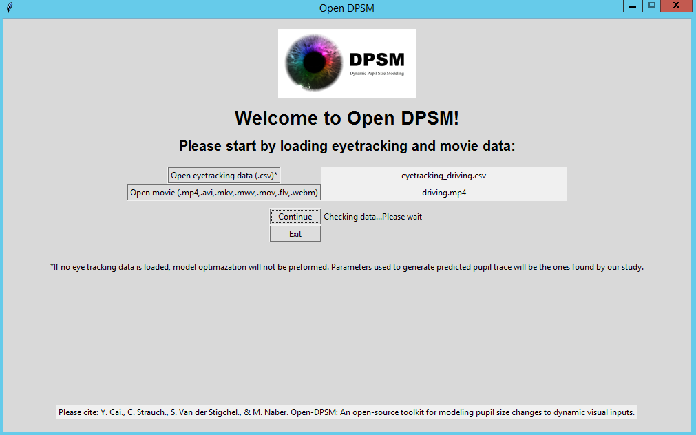

# Open Dynamic Pupil Size Modeling (Open-DPSM) Toolbox

## Table of contents
pending

## Python environment
The toolbox has been tested with the Spyder IDE (Pending: other IDE?)
? pending: how to install spyder

## Loading the toolbox
No installation is required. Simply clone the current repository by following the instructions of: https://docs.github.com/en/repositories/creating-and-managing-repositories/cloning-a-repository

## Start Open-DPSM
There are two format of Open-DPSM:
- [GUI](#GUI): open main_app.py
- [Code](#Code): open main.py

Both of them use the three classes of functions in the "classes" folder

? pending: remove preprocessing.py or adding some functions (e.g. remove blinks, parsing eyelink data to it)

## GUI (pending: insert plots)
### Welcome page: Loading eye tracking data and movie

**Eye-tracking data**

   - Should be in the format of a .csv file with four columns, in the **_exact order_** of:

  1. Timestamps 
  2. Gaze position (x)
  3. Gaze position (y)
  4. Pupil size
 
   - It is recommended that the gaze and pupil data has been preprocessed for blink removal, foreshortening error etc. A function for blink removal is also provided in the classes.preprocessing file but not incorporated in the toolbox yet. You can choose to use it if necessary.
 
   - Gaze position and pupil size can be data of the left eye or the right eye or an average of both eyes, depending on the preference of the user

   - The unit of Timestamps should be in seconds or milliseconds. The default set-up is in seconds. Therefore, if in milliseconds, it will be converted to seconds in later steps. The unit of gaze and pupil data can be anything. They will be z-standardized in the later steps.
     
   - The first row should be the header

**Movie**

  - The possible formats are listed in the welcome page. Those are the format that has been tested. As we use OpenCV to read the video, in principle, any format that can be used in OpenCV can be used.

  - The movie can be a screen recording of the experiment or a video recording of the screen. It is recommended that the video is full-screen, which also means that it will have the same aspect ratio as the eye-tracking data.

  - If the movie is not full-screen, further information will be required in the later pages. However, it is a must that the video is centered on the screen. Please cut it by yourself if it is not.

`Note: We recommend the users not to change any predetermined parameters. However, if the users want to change any, those parameters can be found in classes.App: tkfunctions.__init__
`
## Code
