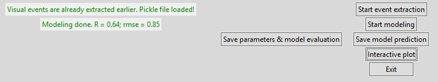

# Open Dynamic Pupil Size Modeling (Open-DPSM) Toolbox

Please cite: Y. Cai., C. Strauch., S. Van der Stigchel., & M. Naber. Open-DPSM: An open-source toolkit for modeling pupil size changes to dynamic visual inputs.

**The toolbox provides functions for (1) Visual event extraction from video input; (2) Pupil response prediction/modeling; (3) Interactive plotting. Open-DPSM can be used in two formats:**

- [GUI](#gui): [main_app.py](main_app.py) (For those who don't use Python, a .exe form of the GUI can be found on https://osf.io/qvn64/. Download *Open-DPSM.zip* and unzip it. The GUI version of Open-DPSM can be started directly by running *Open-DPSM.exe* without Python. Please note that the *App_fig* folder should be in the same directory as the .exe. The executable file will take about 10 seconds to open. Also, using this form means that the user accepts all the default parameters as they cannot be changed.)
- [Code](#code): [main.py](main.py)

**Both contain notes and instructions and should be mostly self-explanatory. See the two main scripts for details. Refer to this page for details of each step.**

Also see: [Example data](#example-data) for details of the data provided as an exemplary user-case

## Loading the toolbox
No installation is required. Simply clone or download the current repository.

## Python environment
The toolbox has been built and tested with the Spyder IDE (version 5) with Python 3.9.7. 

Besides Spyder, Jupiter Notebook (6.4.5)/JupiterLab (3.2.1) and PyCharm (2013.1.4) have also been also tested. 

Note: With Jupiter notebook/JupiterLab, create a new .ipynb file under the same directory and run the following codes to start the GUI:
```python
import os
script_path = "main_app.py"
os.system(f'python {script_path}')
```

## Packages
The toolbox depends on those packages: [numpy](https://numpy.org/install/), [pandas](https://pandas.pydata.org/docs/getting_started/install.html), [scipy](https://scipy.org/install/), [OpenCV](https://pypi.org/project/opencv-python/), [moviepy](https://zulko.github.io/moviepy/install.html), [matplotlib](https://matplotlib.org/stable/users/installing/index.html), [pillow](https://pillow.readthedocs.io/en/stable/installation.html)

Please refer to their installation instructions and make sure that they have been correctly installed before using it.

## GUI 

- Before run *main_app.py*, *initialDir* and *dataDir* need to be changed. *initialDir* should be the directory of Open-DPSM and the *dataDir* should be the directory of where your data is saved (all the results will also be saved under *dataDir*)

- Run *main_app.py* to start GUI

### Welcome page: Loading eye-tracking data and movie


**Eye-tracking data**

   - Load a .csv file with four columns, in the **_exact order_** of:

  1. Timestamps 
  2. Gaze position (x) 
  3. Gaze position (y) 
  4. Pupil size
 
   - It is important that the **left corner of the screen** should have the gaze position coordinates x = 0 and y =0. Please convert the gaze positions if it is not the case.

   - Pupil size should be in diameter.
   
   - It is recommended that the gaze and pupil data have been preprocessed for blink removal, foreshortening error etc. before loading into Open-DPSM. A function for blink removal is provided in the classes.preprocessing, but not incorporated in the toolbox. The user can choose to use it if desired.
 
   - Gaze position and pupil size can be data of the left eye or the right eye or an average of both eyes, depending on the preference of the user.

   - The unit of Timestamps should be in seconds or milliseconds. The default set-up is in seconds. If in milliseconds, it will be converted to seconds in later steps. The unit of gaze and pupil data can be anything. They will be z-standardized in the later steps.
     
   - The first row should be the header as given above

     > Note: Eye-tracking data is not a must for the toolbox. If no eye-tracking data is loaded, the toolbox will extract the visual events from the movie and generate a predicted pupil trace based on the parameters we obtained from our data.

**Movie**

  - The tested formats are listed on the welcome page. As we use OpenCV to process the video, in principle, any format that can be used in OpenCV can be used.

  - The movie can be a screen recording of the experiment or a video recording of the screen. It is recommended that the video loaded is full-screen in the experiment, which means that it has the same resolution as the eye-tracking data.

  - If the movie is not full-screen, further information is required in the later pages. However, it is a must that the center of the video is the center of the screen. Please cut it by yourself if it is not.

### Checking the information page


- Basic information about the eye-tracking data and movie data will be extracted and shown. If anything is not correct, please exit and check the data.

### Entering the information page

Information that cannot be extracted from the files needs to be entered manually by the user:

- Difference in durations: The toolbox will extract the duration of the movie based on its frame rate and its number of frames available (ret = True in OpenCV) and the duration of the eye-tracking data based on the last row of the timestamp. It is highly possible that the two lengths are not exactly the same. If this is the case, there are two options:

  (1) Stretch to match: This means that the two lengths will be considered the same (no matter which one is longer) and the eye-tracking data will be downsampled to the framerate of the video with its original length
  
  (2) Cut the last part of the longer file: This means that the file with a longer length will be chopped at the end before the downsampling of the eye-tracking data.

- Maximum luminance of the screen: This is the physical luminance level of the luminance when the color white is shown and can be measured with a photometer

- Resolution for the coordinate system of eye-tracking data (also the resolution of the screen): Height and width of the eye-tracking coordinate system. Note that it should be the absolute length, not the maximum coordinates of the eye-tracking coordinate system.

### Select the position of the video relative to the screen 
If the aspect ratio (Height/width) of the video and the eye-tracking data are not the same, then the user needs to choose which of the following four positions is used: 

**A**: The aspect ratio of the video is smaller than that of eye-tracking data & the video is full-screen;

**B**: The aspect ratio of the video is smaller than that of eye-tracking data & the video is not full-screen; 

**C**: The aspect ratio of the video is larger than that of eye-tracking data & the video is full-screen;

**D**: The aspect ratio of the video is larger than that of eye-tracking data & the video is not full-screen

> Full-screen: Either height or width of the video is the same as the screen and the actual height and width of the video will be determined by toolbox. If not full-screen, the actual height and the width of the video will be required on the next page.


### Entering more information page (optional)


If the video is not full-screen, extra information is needed:

- Actual height and width of the video: Height and width of the video relative to the eye-tracking data resolution. *Note that it is __not__ the resolution in the video file.* For example, if the resolution of the eye-tracking data is 1000x500 and the physical height and width of the video displayed is half of the physical height and width of the screen, then 500 and 250 should be entered.

- Background color of the screen: Color for the part of the screen surrounding the video. Entering the RGB values (0-255). For example, enter R=0, G=0 and B=0 if it is black.

### Visual events extraction 


`Start event extraction`: Start visual event extraction. When it is completed, video information, timestamps, and event trace per image region will be automatically saved as a pickle file named *"[movieName]_[subjectName]_VF_LAB_6X8.pickle"* in a *"Visual events"* folder (under the *dataDir*). If no eye-tracking data is loaded, the pickle file name will be *"[movieName]_NoEyetrackingData_VF_LAB_6X8.pickle"*.

If there is already a pickle file with the name in the "Visual events" folder, then this step will be skipped and the pickle file will be loaded.
    
### Pupil prediction

`Start modeling`: Model pupil size changes to the visual events. If no eye-tracking data are available, it will generate a prediction of pupil trace with a set of free parameters acquired with our data. When it is completed, the model performance will be printed on the left.

`Save parameters & model evaluation`: Save the free parameters found by the model and the model performance as two columns (first column: names; second column: values) in a .csv file named *"[movieName]_[subjectName]_parameters.csv"* in a "csv results" folder (Only when eye-tracking data is available)

`Save model prediction`: Save the actual pupil size and predicted pupil size as a .csv file named *"[movieName]_[subjectName]_modelPrediction.csv"*. Predicted pupil size (z-standardized) will be provided with three columns, one for the combined prediction with both luminance and contrast change, one for prediction with luminance change only, and one for prediction with contrast change only.

### Interactive plot

`Interactive plot`: Open a new window with an interactive plot


`Save fig`: Save the whole figure or a specific subplot

### Final note for GUI version
We recommend keeping all predetermined parameters as they are. However, if the users want to change any of them, those parameters can be found in `classes.App: tkfunctions.__init__`

## Code
- The code version uses the same three classes of functions as the GUI version. Hence, all the steps are nearly identical.
  
- To start, open *main.py* and change all the things under the section "Information entered by the user".
  
- If no eye tracking data are provided, it is important that the line ```subjectFileName = "csv_example_raw_sec(CB cb1).csv"``` is commented out.
  
- Similar to the GUI pages, Code version is divided into different sections.

### Preprocessing section
This part is to extract some basic information from the video and eye-tracking file. The results will be printed.

### Visual events extraction section
- Run this part to perform visual event extraction (see [Visual events extraction](#visual-events-extraction) for more information
  
- The main codes of this section are:
  
```eeObj = event_extraction()```: create an object with the class event_extraction
 
```eeObj.event_extraction()```: call function *event_extraction* in the class event_extraction
 
All the other codes are to load data and predetermined parameters to the *eeObj* object

Similar to the GUI version, if the visual events pickle file is already in the "Visual events" folder, then this step can be skipped and the pickle file will be loaded (please do not run this section and run next section directly

### Pupil modeling 
- Run this part only when eye-tracking data is available. The pupil size changes will be modeled with the visual events extracted in the previous step.
  
- The main codes of this section are:
  
```modelObj = pupil_prediction()```: create an object with the class pupil_prediction

```modelObj.pupil_prediction()```: call function *pupil_prediction* in the class pupil_prediction

All the other codes are for the purpose to load data and predetermined parameters to the *modelObj* object
 
- When it is completed, the model performance will be printed. Parameters selected by the model, model performance and model prediction will be saved (see [Pupil prediction](#pupil-prediction) for more information).

### Interactive plot
- This part of the code can be run together with the *Pupil modeling* part

- Run it will open a window with the interactive plot (see [Interactive plot](#interactive-plot) for more information)

- The main codes of this section are:
  
```plotObj = interactive_plot()```: create an object with the class interactive_plot

```plotObj.plot()```: call function *plot* in the class interactive_plot

All the other codes are to load data and predetermined parameters to the *plotObj* object


### Pupil prediction (no eye-tracking data)
- Run this part when eye-tracking data is not available

- The main codes of this section are:
  
```modelObj = pupil_prediction()```: create an object with the class pupil_prediction

```
if RF == 'HL':
    params = [9.67,0.19,0.8,0.52,0.3, 1,1,1,1,1] 
else:
    params = [0.12,4.59,0.14,6.78,0.28,1,1,1,1,1]
```
Load the parameters found with our data. RF = response function; HL = "Erlang gamma function". The first four parameters are free parameters in response functions (2 for luminance change and 2 for contrast change). The fifth parameter is the weight of the contrast response relative to the luminance response. The last 5 parameters are regional weights, which are set to 1 because we do not consider regional weights here as the visual angles in different datasets can be very different

```modelObj.pupil_predictionNoEyetracking(params)```: Calculate predicted pupil size with the parameters 

All the other codes are for the purpose to load data and predetermined parameters to the *modelObj* object

- When it is completed, pupil prediction will be saved (see [Pupil prediction](#pupil-prediction) for more information).
  
### Interactive plot

- This part of the code can be run after the *Pupil prediction (no eye-tracking data)* part

- Run it to open a window with the interactive plot (see [Interactive plot](#interactive-plot) for more information)

- The main codes of this section are:
  
```plotObj = interactive_plot()```: create an object with the class interactive_plot

```plotObj.plot_NoEyetracking()```: call function *plot_NoEyetracking* in the class interactive_plot

All the other codes are for the purpose to load data and predetermined parameters to the *plotObj* object

### Final note for code version
Similar to the GUI, we recommend keeping all predetermined parameters at default. However, if the users want to change any of them, those parameters can be found and adjusted in *settings.py*

## Example data
The folder "example" contains a sample eye-tracking data of a participant watching a 5-minute video of driving on the road. This clip is not one of the clips from our dataset and only serves as an example for a possible user case. 

To run the example, the user needs to first download the video from: https://www.youtube.com/watch?v=sIsegSg5tps (with a youtube downloader such as: https://en.savefrom.net/1-youtube-video-downloader-528en/). 

After downloading, please run:
```python
# import moviepy
from moviepy.editor import *
import os
# change path
MoviePath = [change the path to the folder you save the movie]
MovieName = [change the name to the name of the movie file]
# read movie
os.chdir(MoviePath)
clip = VideoFileClip(MovieName)
# cut the movie: from 00:17:00 to 00:22:00
clip_cut = clip1.subclip(1020,1320)
# check the movie resolution
w1 = clip1.w
h1 = clip1.h
ratio = w1/h1
print(ratio) # The ratio should be 1920/1080
clip_cut.write_videofile("driving.mp4") 
```
> Note: For those who are using the executable version of the toolbox, cut the movie into 5 minutes from 00:17:00 to 00:22:00 using any video editor application and rename it as "driving.mp4". If possible, also check the resolution of the video in the property of the file. It should be 1920x1080.

Then move *driving.mp4* to the example folder and the example is ready to go. 

As the visual event extraction has been done (saved in the "Visual event" folder), the user can skip the "Visual events extraction" section in the code version. In other folders, there are also exemplary results and figures generated with the toolbox. 
