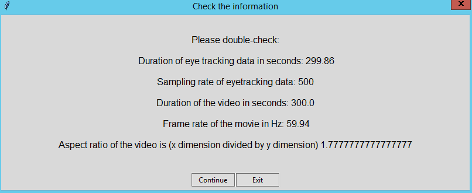
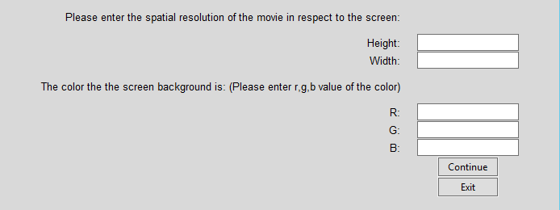

# Open Dynamic Pupil Size Modeling (Open-DPSM) Toolbox
**The toolbox provides functions for (1) Visual events extraction from the video; (2) Pupil prediction; (3) Interactive plotting. There are two formats of Open-DPSM:**

- [GUI](#GUI): main_app.py
- [Code](#Code): main.py
  
**Both of them contain notes and instructions and should be mostly self-explained. Run the two main scripts to start. Refer to this page for details of each step.**


## Python environment
The toolbox has been tested with the Spyder IDE (Pending: other IDE?)
? pending: how to install spyder

## Loading the toolbox
No installation is required. Simply clone or download the current repository.

## GUI 

- Before run *main_app.py*, *initialDir* and *dataDir* need to be changed. *initialDir* should be the directory of Open-DPSM and the dataDir should be the directory of where your data is saved (all the results will also be saved under *dataDir*)

- Run *main_app.py* to start GUI

### Welcome page: Loading eye-tracking data and movie


**Eye-tracking data**

   - Should be in the format of a .csv file with four columns, in the **_exact order_** of:

  1. Timestamps 
  2. Gaze position (x)
  3. Gaze position (y)
  4. Pupil size
 
   - It is recommended that the gaze and pupil data has been preprocessed for blink removal, foreshortening error etc. A function for blink removal is also provided in the classes.preprocessing file but not incorporated in the toolbox yet. The user can choose to use it if necessary.
 
   - Gaze position and pupil size can be data of the left eye or the right eye or an average of both eyes, depending on the preference of the user

   - The unit of Timestamps should be in seconds or milliseconds. The default set-up is in seconds. Therefore, if in milliseconds, it will be converted to seconds in later steps. The unit of gaze and pupil data can be anything. They will be z-standardized in the later steps.
     
   - The first row should be the header

   - *Note: Eye-tracking data is not a must for the toolbox. If no eye-tracking data is loaded, the toolbox will extract the visual events from the movie and generate a predicted pupil trace based on the parameters we obtained from our data.*

**Movie**

  - The possible formats are listed on the welcome page. Those are the format that has been tested. As we use OpenCV to read the video, in principle, any format that can be used in OpenCV can be used.
  - The movie can be a screen recording of the experiment or a video recording of the screen. It is recommended that the video is full-screen, which also means that it will have the same aspect ratio as the eye-tracking data.

  - If the movie is not full-screen, further information will be required in the later pages. However, it is a must that the video is centered on the screen. Please cut it by yourself if it is not.

### Checking the information page


- Some basic information about the eye-tracking data and movie data will be extracted and shown. Note that one important feature of the movie is the aspect ratio, which will be used in the later data processing

- If anything is not correct, please exit and check the data.

### Entering the information page

Information that cannot be extracted from the files needs to be entered manually by the user:

- The toolbox will extract the length of the movie based on its framerate and its number of frames available (ret = True in OpenCV) and the length of the eye tracking data based on the last row of the timestamp. It is highly possible that the two lengths are not exactly the same. If this is the case, there are two options:

  (1) Stretch to match: This means that the two lengths will be considered the same (no matter which one is longer) and the eye-tracking data will be downsampled to the framerate of the video with its original length
  
  (2) Cut the last part of the longer file: This means that the file with a longer length will be chopped at the end before the downsampling of the eye-tracking data.

- Maximum luminance of the screen: This is the physical luminance level of the luminance when the color white is shown and can be measured with a photometer

- Spatial resolution of eye tracking data: Width and height of the eye tracking data. Note that it should be the absolute length, not the maximum number of the coordinate system.

### Select the position of the video relative to the screen 
If the aspect ratio (Height/width) of the video and the eye-tracking data are not the same, then the user needs to choose which of the following four positions is used: **A&B** Aspect ratio of the video is smaller than that of eye-tracking data; **C&D** Aspect ratio of the video is bigger than that of eye-tracking data; **A&C** The video is full-screen, which means that either height or width of the video is the same as the screen and the actual height and width of the video (relative to the eye-tracking data resolution) will be calculated; **B&D** The video is not full-screen, which means that the actual height and the width of the video are unknown and needs to be entered on the next page


### Entering more information page (optional)
If the video is not full-screen, some extra information may be acquired:

- Actual height and width of the video: Height and width of the video relative to the eye-tracking data resolution. *Note that it is not the resolution in the video file.* For example, if the resolution of the eye-tracking data is 1000x500 and the physical height and width of the video displayed is half of the physical height and width of the screen, then 500 and 250 should be entered.

- Background color of the screen: color for the part of the screen surrounding the video. For example, enter R=0, G=0 and B=0 if it is black.

### Event extraction 
`Start event extraction`: Start visual event extraction. When it is completed, video information, timestamps, and event trace per image region will be automatically saved as a pickle file named *"movieName_subjectName_VF_LAB_6X8.pickle"* in a *"Visual events"* folder (under the *dataDir*). If no eye-tracking data is loaded, the pickle file name will be *"movieName_NoEyetrackingData_VF_LAB_6X8.pickle"*.
    
### Pupil prediction

`Start modeling`: Predict the pupil size with the visual events. If no eye-tracking data is available, it will generate a prediction of pupil trace with a set of free parameters acquired with our data. When it is completed, the model performance will be printed on the left.

`Save parameters & model evaluation`: Save the free parameters found by the model and the model performance as a .csv file named "movieName_subjectName_parameters.csv" (Only when eye-tracking data is available)

`Save model prediction`: Save the actual pupil size and predicted pupil size as a .csv file named "movieName_subjectName_modelPrediction.csv". Predicted pupil size will have three columns, one for the combined prediction with luminance and contrast change, one for prediction with luminance change only, and one for prediction with contrast change only.

### Interactive plot

`Interactive plot`: Open a new window with an interactive plot


`Save fig`: Save the whole figure or specific subplot

### Note for GUI version
We recommend keeping all predetermined parameters as they are. However, if the users want to change any of them, those parameters can be found in `classes.App: tkfunctions.__init__`

## Code
- The code version uses the same three classes of functions as the GUI version. Hence, most steps are the same.
- To start, open *main.py* and change all the things under the section "Information entered by the user"
- If no eye tracking data, it is important that the line ```subjectFileName = "csv_example_raw_sec(CB cb1).csv"``` is commented out

### Preprocessing section
This part is to extract some basic information from the video and eye-tracking file. The results will be printed out.

### Visual events extraction section
- Run this part will perform event extraction (see [Event extraction](#Event-extraction) for more information
  
- The main codes of this section are:
  
```eeObj = event_extraction()```: create an object with the class event_extraction
 
```eeObj.event_extraction()```: call function *event_extraction* in the class event_extraction
 
All the other codes are for the purpose to load data and predetermined parameters to the *eeObj*


### Pupil modeling 
- Run this part when eye-tracking data is available. The pupil size will be modeled with the visual events extracted in the previous step
  
- The main codes of this section are:
  
```modelObj = pupil_prediction()```: create an object with the class pupil_prediction

```modelObj.pupil_prediction()```: call function *pupil_prediction* in the class pupil_prediction

All the other codes are for the purpose to load data and predetermined parameters to the *modelObj*
 
- When it is completed, the model performance will be printed out. Parameters selected by the model, model performance and model prediction will be saved (see [Pupil prediction](#Pupil-prediction) for more information).

### Interactive plot
- This part of code can be run together with *Pupil modeling* part

- Run it will open a window with the interactive plot (see [Interactive plot](#Interactive-plot) for more information)

- The main codes of this section are:
  
```plotObj = interactive_plot()```: create an object with the class interactive_plot

```plotObj.plot()```: call function *plot* in the class interactive_plot

All the other codes are for the purpose to load data and predetermined parameters to the *plotObj*


### Pupil prediction (no eye-tracking data)
- Run this part when eye-tracking data is not available

- The main codes of this section are:
  
```modelObj = pupil_prediction()```: create an object with the class pupil_prediction

```
if RF == 'HL':
    params = [9.67,0.19,0.8,0.52,0.3, 1,1,1,1,1] 
else:
    params = [0.12,4.59,0.14,6.78,0.28,1,1,1,1,1]
```
Load the parameters found with our data. RF = response function; HL = "Erlang gamma function". The first four parameters are free parameters in response functions (2 for luminance change and 2 for contrast change). The fifth parameter is the weight of the contrast response relative to the luminance response. The last 5 parameters are set to 1 because we do not consider regional weights here as the visual angles in different datasets are very different

```modelObj.pupil_predictionNoEyetracking(params)```: Calculate predicted pupil size with the parameters 

All the other codes are for the purpose to load data and predetermined parameters to the *modelObj*

- When it is completed, pupil prediction will be saved (see [Pupil prediction](#Pupil-prediction) for more information).
### Interactive plot
- This part of code can be run together with *Pupil prediction (no eye-tracking data)* part

- Run it will open a window with the interactive plot (see [Interactive plot](#Interactive-plot) for more information)

- The main codes of this section are:
  
```plotObj = interactive_plot()```: create an object with the class interactive_plot

```plotObj.plot_NoEyetracking()```: call function *plot_NoEyetracking* in the class interactive_plot

All the other codes are for the purpose to load data and predetermined parameters to the *plotObj*

### Note for code version
Similar to the Gui version, we recommend keeping all predetermined parameters as they are. However, if the users want to change any of them, those parameters can be found in *settings.py*
